# ModalDish

[Demo video](https://youtu.be/EDX9046LzlA) · [Download the latest release](https://github.com/odoare/ModalDish/releases) · [FX-Mechanics](https://fx-mechanics.com)

ModalDish is an audio plugin based on a physical model of a plate of arbitrary shape, solved by finite elements. It can be played as an instrument (strike it) or used as an effect (feed it audio).

<div align="center">

</div>

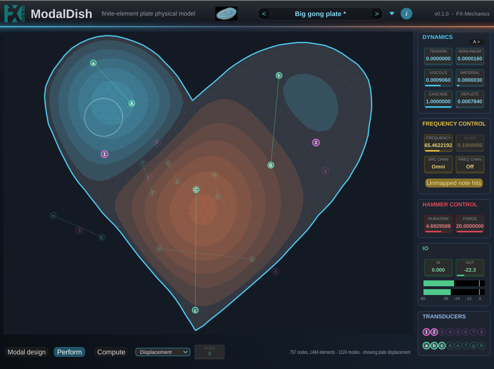

The principle is to draw a shape, cut its border into segments and give each one a boundary condition, press *Compute*, and the plugin solves the plate's eigenmodes and turns them into a bank of resonant filters. From there it is an instrument or effect: hit it with the mouse, play it from MIDI, or send a signal through it.

This is a physically modelled structure. Nothing is sampled and nothing is convolved. The plate exists as a set of modes that the geometry actually produced, so moving the strike point, the pickup, the tension or the damping changes the sound the way it would change a real plate.

ModalDish adds two geometric nonlinearities to the modal bank: a dynamic tension that bends the pitch up on a hard hit, and an eight-band cubic cascade that carries energy up the spectrum into shimmer. Solving the von Kármán equations directly is the more faithful route, and Bilbao, Webb, Wang and Ducceschi have run it in real time [[1]](#references), though on a fixed rectangle and at roughly an order of magnitude more CPU than the whole of ModalDish. Both nonlinearities here are cheap surrogates instead, and the cascade runs on whatever shape you drew rather than a fixed geometry. The result is a plugin that consumes at most a few percent of CPU on current computers with all parameters at max quality.

---

## Contents

- [How it works](#how-it-works)
- [Signal path](#signal-path)
- [Installing](#installing)
- [The interface](#the-interface)
- [Parameters](#parameters)
- [Playing it](#playing-it)
- [Geometry files](#geometry-files)
- [Presets](#presets)
- [Building](#building)
- [Repo layout](#repo-layout)
- [References](#references)
- [License](#license)

---

## How it works

As any structural object the plate vibrations can be decomposed along its modes, which are standing patterns, each with its own frequency and its own map of where the plate moves and where it stays still. Strike a plate and you excite every mode that happens to be moving at the point you struck. Listen at a point and you hear every mode that is moving *there*. It is why hitting a cymbal near the rim and near the bell give two different sounds.

For a circle or a rectangle those modes have closed-form answers. For any shape drawn by hand they do not, so ModalDish computes them using a standard mathematical method calle the *Finite Elements Method*.

The overall workflow of ModalDish can be sketched like this:

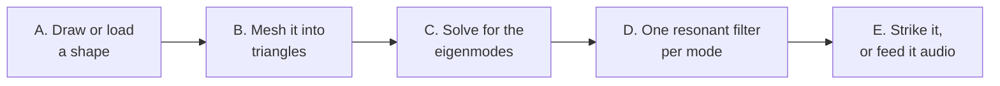

A. **The shape** is a closed outline with a boundary condition on each part of its edge: clamped, simply supported, sliding, or free.

B. **The mesh** cuts the interior into triangles (the *Grid* control sets how fine).

C. **The eigensolve** finds the first N eigenmodes and normalized eigenfrequencies of the meshed plate. This is a max few seconds step, and it runs in the background while the previous plate keeps sounding.

D. **The filter bank** is one constant-peak band-pass per mode. Mode *k* gets its centre frequency from the eigenvalue and its bandwidth from the damping controls. A strike at point **A** feeds every filter in proportion to how much mode *k* moves at **A**. A pickup at point **B** sums every filter in proportion to how much mode *k* moves at **B**.

E. **Above the computed modes**, the bank is filled out to as many as 1024 with a statistical tail: synthetic modes with the spacing a plate of that area really has and randomised shapes. Solving cost is very small compared to the eigenmodes calculation and it gives the nonlinearities somewhere to put their energy up to the Nyquist frequency.

Two things then make it behave like a real nonlinear plate rather than like a linear filter bank:

**Dynamic tension.** A plate bent hard is also stretched, which stiffens it and raises its pitch. 

**Mode cascade.** A hard-driven plate also sees its eigenmodes coupled, i.e. there is and energy exchange between them. This induces and energy cascade from lower to higher frequencies, which is where a crash cymbal's shimmer comes from. The *Cascade* parameter quantifies the effect of an eight-band ladder in which each band is pumped by a cubic of the bands below it, so loud hits brighten progressively and the effect vanishes at low level. *Deplete* is the other half of the trade: while a band pumps the ones above it, it loses that energy itself, so the lows audibly hand over rather than ringing on underneath.

The full derivation (the Kirchhoff plate with tension, the Morley element, the shift-invert subspace eigensolver, the Berger approximation, the cascade ladder and the statistical tail) will be found in the [technical doc repo](https://github.com/odoare/ModalDishPaper).

## Signal path

The detailed path, from a note or a sample arriving to a sample leaving.

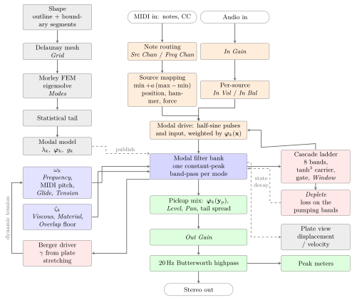


## Installing

Builds are published on the [releases page](https://github.com/odoare/ModalDish/releases): a zip per platform, plus a `.pkg` installer for macOS. VST3 and AU on macOS, VST3 on Windows and Linux, with a standalone application everywhere.

### macOS

ModalDish is free software and is **not signed with an Apple Developer ID**
(that is a paid Apple subscription). macOS therefore marks anything downloaded through a browser as untrusted, and the DAW skips it during its scan, usually with no error at all: the plugin simply never appears.

After copying the bundles into place, run the lines matching what you
installed:

```sh
xattr -dr com.apple.quarantine /Library/Audio/Plug-Ins/VST3/ModalDish.vst3
xattr -dr com.apple.quarantine /Library/Audio/Plug-Ins/Components/ModalDish.component
```

Then rescan. If you used the `.pkg` and macOS refused to open it, right-click it and choose Open rather than double-clicking.

The builds are universal (Apple Silicon and Intel) and target macOS 10.13 and later.

### Windows and Linux

Copy `ModalDish.vst3` into the VST3 folder your host scans
(`C:\Program Files\Common Files\VST3` on Windows, `~/.vst3` on Linux) and
rescan. Nothing else is needed.

## The interface

The window has three parts: the top bar, the plate area on the left, and the control panels on the right.

The plugin has two modes, and the panels on screen are the ones belonging to the mode you are in. *Modal design* is what the plate is and *Perform* is how you play it. The buttons for both are in the strip under the plate, along with *Compute*, the progress bar and the status line.

The split is not cosmetic. *Modes* reallocates and retunes the entire filter bank, and raising it while the plate is ringing can produce a very loud transient, so it lives on the design side where you are not playing.

Every control explains itself on hover, in a sentence or two. The panels are dense and the names on the boxes are necessarily short, so the tooltip is where a control says what it is for; the tables further down say the same things at more length. The **?** button in the top bar turns them off once you no longer need them, and the **i** beside it opens the list of keyboard and mouse shortcuts.

Closing the plugin window and reopening it is a no-op: the mode you were in, the view you had selected, the tool, whether tooltips are on, the Cascade column and the angle you had turned the 3D plate to all come back as you left them. None of that is in the preset or in the session.

### Modal design

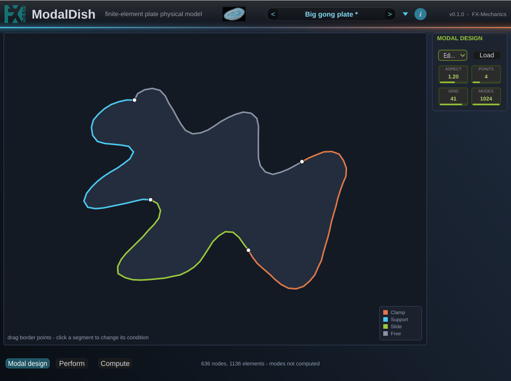

The modal design panel holds a tool selector across the top, four controls under it, and *Load* and *Save* on a row of their own at the bottom.

Tools description:

| | |
| --- | --- |
| **Draw shape** | Freehand. Drag a closed curve; it is smoothed with a closed spline and resampled to 128 points. |
| **Place points** | A polygon, vertex by vertex. See below. |
| **Rotate** | Drag to turn the shape inside the canvas. |
| **Edit boundary** | Drag the segment dividers (*Points* sets how many) and click a segment to cycle its condition. |

There are two additional buttons *Ellipse* and *Rectangle* that produce a shape with the aspect ratio fixed by the right panel control.

Boundary conditions are ordered stiffest first, and colour-coded in the key: clamp, support, slide, free. The stiffer the boundary condition, the higher the frequency separation. Note that with the maximum of 1024 modes, it is not possible to cover the full audible range in the less constrained case of a free plate.

Segments are stored as fractions of the perimeter, so they follow the outline when you reshape it rather than sliding off it.

#### Place points

A polygon edited vertex by vertex, for when a shape wants exact corners
rather than a drawn curve.

- **Click**: adds a vertex. Below three points you are building an open chain
  and the third closes it; once closed, a click inserts the new vertex into
  the edge nearest the click, which refines the outline instead of folding
  it over itself.
- **Drag a vertex**: moves it. The mesh is rebuilt on release, not during the
  gesture.
- **Alt-click a vertex**: deletes it. Alt-clicking empty space does nothing. The last three are kept, since fewer than three is not a shape the mesher   can take, so deleting down to a triangle and dragging it about is how you start over.

Switching to this tool **adopts whatever shape is already on screen**, so a
freehand blob or an ellipse can be taken over and edited.

Shapes already sparse enough (a rectangle, or one loaded from a file) are
adopted untouched. Boundary conditions are carried as arc-length fractions,
so they survive the reduction.

### Compute

*Compute* runs the modal analysis in the background, shows a progress bar,
and drops you into Perform when it finishes. The plate goes on sounding the
previous model until the new one is ready, so editing never cuts the audio.

*Perform* on its own goes back to the last model computed, keeping the shape,so a shape can be worked on across several passes without the plate ever falling silent.

What a solve costs depends both on mode count and the grid setting.

### Perform

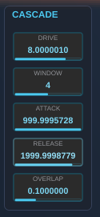

Click the plate to hit it. The view selector next to *Perform* chooses what
the plate area shows:

| View | Shows |
| --- | --- |
| **Modes** | one eigenmode at a time, picked by the *Mode* control beside it, with its frequency in the status line |
| **Displacement** | the live deflection of the sounding plate, at 30 Hz |
| **Velocity** | the same field one power of frequency higher, which weights the high modes up |
| **Displacement 3D** / **Velocity 3D** | the same two as a lit surface; drag to rotate, wheel to zoom |

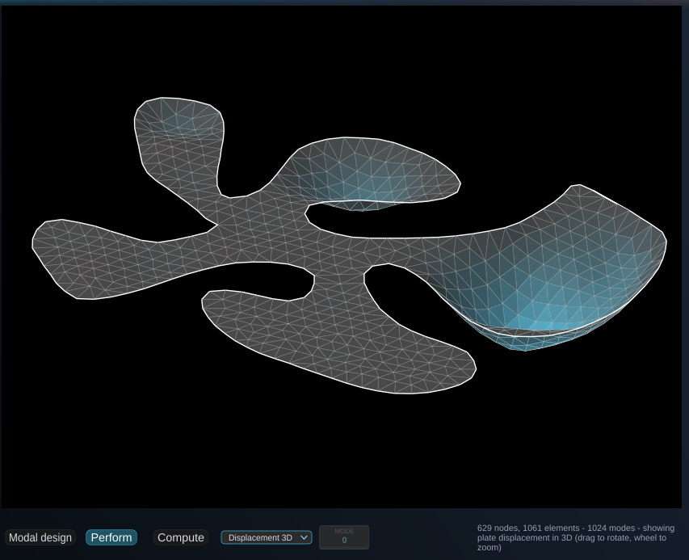

Velocity only looks different from displacement when high modes are actually
ringing. With the default 3 ms hammer the two are indistinguishable; at
0.3 ms the velocity field carries about twice the spatial detail. Neither
shows the cascade, whose shimmer lives in the statistical tail, and tail modes have no mesh shape to draw.

### Markers: pickups and sources

The plate carries up to eight **pickups** (magenta circles, labelled 1-8) and up to eight **sources** (teal circles, labelled a-h). Pickups are where you listen. Sources are where the plate gets hit and where the input goes in. A disabled one is drawn as a faint ring.

Out of the box, pickup 1 is on and centred at unity gain, and source *a* is on and centred at full send: a single mono listening point and a single injection point.

This table gives the implemented gestures for the source and pickup design:

| Gesture | Effect |
| --- | --- |
| `1`-`8` / `a`-`h` with the mouse over the plate | put that pickup or source under the cursor, switching it on |
| `A`-`H` with the mouse over the plate | put that source's *velocity endpoint* under the cursor |
| click a marker | open its panel: every parameter of that one point |
| alt-click a marker | switch it off |
| click anywhere else | hit the plate there, with the global *Duration* and *Force* |
| right-click / ctrl-drag | move pickup 1 |

The **TRANSDUCERS** panel repeats those sixteen markers as two rows of switches, pickups above and sources below, drawn as the very markers they control so the rows read as a picture of what is currently on. They are the same parameters as the *On* button in a marker's own panel and as alt-click on the plate.

### Marker panels

Clicking a marker opens its panel over the plate.

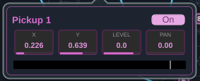

A **pickup** panel has X, Y, Level, Pan, On, and a meter of what that point is hearing: mono, with its Level applied and its Pan not, so it answers how much this pickup is picking up rather than where that lands in the image. Only the pickup whose panel is open is metered.

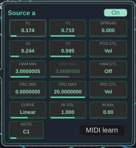

A **source** panel is a five-by-three grid, plus a *Note* box and a *MIDI learn* button in the footer. Three of its quantities are mapped: where it strikes, how long the hammer stays in contact, and how hard. Each is a *min* / *max* pair plus a *Control* choosing what moves between them. See [Source mappings](#source-mappings).

### Meters

Every meter in the plugin reads **peak**, held and then falling at 20 dB per second. The two IO meters read the master pair, post *Out Gain* and post highpass, which is what actually leaves the plugin.

## Parameters

### MODAL DESIGN

| Control | Range | Default | What it does |
| --- | --- | --- | --- |
| **Aspect** | 0.25 - 4 | 1.2 | width-to-height of the *Ellipse* and *Rectangle* tools |
| **Points** | 1 - 12 | 4 | number of boundary segments the edge is cut into |
| **Grid** | 8 - 48 | 16 | mesh density (elements across the plate). Finer is more accurate, not more modes. |
| **Modes** | 1 - 1024 | 192 | size of the filter bank. Past the computed FEM count (up to 256) the rest is the statistical tail. |

Increasing *Grid* and *Modes* increase computational cost. Accuracy comes from *Grid*. Frequency range and shimmer density come from *Modes*. Only modes below the Nyquist frequency are processed, so at a high *Frequency* setting a large bank costs nothing past the point where the spectrum runs out. Because the added frequencies of the tail continues at the plate's own spacing, bank size determines the frequency range, not the density because added modes go above the ones already there rather than between them. So increasing range helps for small values of the *Frequency* parameter range, where the plate runs out of spectrum well below the Nyquist frequency.

### FREQUENCY CONTROL

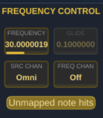

| Control | Range | Default | What it does |
| --- | --- | --- | --- |
| **Frequency** | 1 - 2000 Hz | 110 Hz | where mode 1 lands. Everything else follows the ratios the geometry gives it. |
| **Glide** | 0.1 - 100 ms | 0.1 ms | portamento between MIDI-tuned notes |
| **Src Chan** | Omni, 1 - 16 | Omni | the MIDI channel that triggers |
| **Freq Chan** | Off, 1 - 16 | Off | the MIDI channel that tunes |
| **Unmapped note hits** | on / off | on | what a note no source claims does |

The *Frequency* parameter starts at 1 Hz. The output carries a fixed second-order Butterworth highpass at 20 Hz so that what the low settings do not use never reaches a woofer. Tuning a plate's base frequency so low is useful when one wants to increase modal density, at the price of a lower upper value of the frequency range.

*Glide* is a time in seconds, and the travel is logarithmic, so a glide takes the same time whatever the interval.

### DYNAMICS

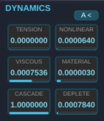

| Control | Range | Default | What it does |
| --- | --- | --- | --- |
| **Tension** | 0 - 500 | 0 | tension against flexural stiffness. 0 is a pure plate; large is membrane-like. |
| **Nonlinear** | 0 - 1 | 0 | dynamic tension: pitch glides up on a hard hit |
| **Viscous** | 1e-6 - 0.1 | 1e-4 | damping through the plate's velocity |
| **Material** | 1e-6 - 0.1 | 7e-6 | damping through internal friction |
| **Cascade** | 0 - 1 | 0 | amount of upward energy transfer, and its off switch |
| **Deplete** | 0 - 1 | 0.07 | how much the pumping bands lose in return |
| **A >** | | closed | opens the CASCADE column |

**Tension** retunes the bank at audio rate: the eigenproblem is solved at whatever tension was set when *Compute* ran, and moves around it follow an approximated first-order law, which allows instantaneous recomputation of the frequencies. Press *Compute* again for exactness at a very different tension. Note that it keeps mode 1 pinned at *Frequency* and reshapes the ratios only, where *Nonlinear* moves the whole spectrum including the fundamental.

**Viscous** and **Material** are both the damping ratio of mode 1, and they differ in what they do to everything above it: viscous damping decays relatively slower for high modes, material damping faster, allowing a variety of vibrational timbres.

**Nonlinear** is calibrated in audible glide rather than in plate units, so the same setting bends by about the same amount on any shape. The whole spectrum rises on a hard hit and relaxes as the plate rings out.

**Cascade** at 0 is off in a stronger sense than just silent: the *Overlap* bandwidth floor is scaled by the amount too, so at 0 the target modes keep the plate's own damping instead of being quietly widened while nothing is being pumped.

### CASCADE (the **A >** column)

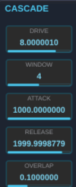

These parameters voiceallows fine tuning of the cascad effect. Recommended workflow is to set them with *Cascade* already up, then bring *Cascade* to a satisfying value.

| Control | Range | Default | What it does |
| --- | --- | --- | --- |
| **Drive** | 0.1 - 30 | 8 | the tanh knee: what the carrier is *made of* |
| **Window** | 1 - 7 | 4 | how many bands below each band pump it |
| **Attack** | 1 - 1000 ms/band | 30 | gate attack, growing with the band's height |
| **Release** | 20 - 4000 ms | 2000 | gate release: how the pumping tails off |
| **Overlap** | 0 - 1 | 0.1 | bandwidth floor on the receiving modes |
| **Modal inject** | off / on | off | where the ladder's output re-enters the plate |

**Modal inject** chooses where the ladder puts its output back into the
plate. Off, the default, injects it at the hit point, through the same mode
shapes a hammer strike uses. On, it injects through a fixed per-mode
weighting instead.

On is the more physical of the two choices, but still approximated. The nonlinear coupling of a real plate is an integral over the whole plate and contains no strike position at all. The option is left to the user to let more timbre choices. Both are worth having, which is why this is a switch and not a correction. Off ties the shimmer's character tightly to where you play, which is expressive even though it is not what a plate does. One case is worth knowing about: a strike on a symmetric plate's exact centre is a node of most modes, so few of them ring and the cascade is much weaker.

Two things about **Drive**: It is not gradual: at *Cascade* 1 and *Force* 1 (the default), everything from 0.1 to 4 is silent and 4 to 16 covers 76 dB. And where that window sits depends on how hard you play. So *Drive* may have sometimes to be adjusted by hear.

### HAMMER CONTROL

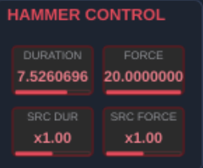

| Control | Range | Default | What it does |
| --- | --- | --- | --- |
| **Duration** | 0.1 - 50 ms | 3 ms | length of the half-sine shock |
| **Force** | 0 - 20 | 1 | its amplitude |
| **Src Dur** | x0.1 - x10 | x1 | scales every source's hammer duration |
| **Src Force** | x0.1 - x10 | x1 | scales every source's force |

*Duration* and *Force* are for the "mouse" hammer, triggered by a click on
bare plate and by a MIDI note no source claims (if the corresponding option is on). A source has its own pair, and its own mapping for each. The attack of a soft mallet would correspond to short time and large force, the opposite for a stick.

*Src Dur* and *Src Force* are trims over all eight sources, multiplying each one whatever a source's own min/max mapping. They are what makes a kit of eight playable as one instrument, since hitting the whole set harder or softer is otherwise sixteen knob moves. They do not touch the global hammer above, which is already a single control.

### IO

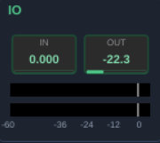

| Control | Range | Default | What it does |
| --- | --- | --- | --- |
| **In Gain** | 0 - 2 | 0 | how much of the plugin input reaches the sources |
| **Out Gain** | -36 - +12 dB | 0 dB | master level, before the highpass |

*In Gain* at 0 is the instrument case: nothing goes in and the plate is played by strikes alone. Raise it to use ModalDish as an effect.

### Pickup panel

| Control | Range | Default | What it does |
| --- | --- | --- | --- |
| **X**, **Y** | 0 - 1 | pickup 1 at centre | where on the plate this pickup listens |
| **Level** | -60 - +12 dB | 0 dB | its contribution to the mix |
| **Pan** | -1 - +1 | pickup 1 centred | equal-power, with the centre at unity |
| **On** | | pickup 1 only | |

The pickups are a linear mix, so the audio loop costs the same whether one is on or eight. But note that as they sum up, the audio can be significantly louder with 8 pickups than with one.

Positions matter most for the low modes, where a handful of mode shapes give each point its own emphasis. High in the spectrum, hundreds of positive terms converge to nearly the same value wherever the pickup sits, which is why the statistical tail carries its own stereo spread instead.

### Source panel

The grid, left to right and top to bottom:

| | | |
| --- | --- | --- |
| X1 | Y1 | Spread |
| X2 | Y2 | Pos Ctl |
| Ham Min | Ham Max | Ham Ctl |
| Frc Min | Frc Max | Frc Ctl |
| Curve | In Vol | In Bal |

| Control | Range | Default | What it does |
| --- | --- | --- | --- |
| **X1**, **Y1** | 0 - 1 | source *a* at centre | where this source strikes at zero control |
| **X2**, **Y2** | 0 - 1 | on top of X1/Y1 | where it strikes at full control |
| **Spread** | 0 - 0.25 | 0 | standard deviation per axis of a random offset on every hit |
| **Ham Min** / **Ham Max** | 0.1 - 50 ms | 3 ms | this source's hammer duration, at zero and full control |
| **Frc Min** / **Frc Max** | 0 - 20 | 0 and 1 | its force, at zero and full control |
| **Pos Ctl** | Off / Vel / CC 0-127 | Vel | what moves the strike point |
| **Ham Ctl** | Off / Vel / CC 0-127 | Off | what moves the hammer duration |
| **Frc Ctl** | Off / Vel / CC 0-127 | Vel | what moves the force |
| **Curve** | Slow / Linear / Fast | Linear | shape applied to velocity before it drives anything |
| **In Vol** | 0 - 2 | source *a* at 1 | this source's share of the plugin input |
| **In Bal** | -1 - +1 | 0 | which side of the incoming stereo pair it takes |
| **Note** | Off, C-1 - G9 | Off | the MIDI note this source answers to |
| **On** | | source *a* only | |

*Spread* randomizes around wherever the mapping placed the hit.

The shipped defaults (*Frc Min* 0, *Frc Max* 1, *Frc Ctl* Vel) are exactly "velocity scales force".

Only strikes follow the mappings. The audio input is injected at the *X1*/*Y1* point alone, a continuous signal having no velocity to place it by.

Also note that a force of 1 doesn't raise a lot the nonlinearities or might sound too low. Generally, interesting behaviours arise when the force is pushed higher.

## Playing it

### With the mouse

Click anywhere on the plate that is not a marker and it is struck there, with the global *Duration* and *Force*. That is the fastest way to audition a shape, and it is what the design and compute cycle is built around.

### Source mappings

Each source has three quantities that a control can move:

- **where** it strikes

- **how long** the hammer is in contact

- **how hard**.

Each is a min/max pair and a *Control*.

The value used for a strike is

```
value = min + amount x (max - min)
```

where *amount* is between 0 and 1 and comes from the *Control*:

- **Off** holds the quantity at its *min*.
- **Vel** uses the triggering note's velocity, shaped by *Curve* (slow, linear, or fast)
- **A CC number** is taken as the player's hardware left it, uncurved, and is read at strike time from the sources' MIDI channel. A controller that has never moved reads zero, holding the min.

**Min is not required to be below max.** Putting it above simply inverts the mapping, so a source can hit *softer* the harder it is played, or move toward the rim as a pedal is released.

**Position** is the segment drawn on the plate. The lower-case marker (*a*) is the *min* end and the upper-case one (*A*) the *max*. Played across the range, the plate is struck in different places, nearer the rim or nearer the centre, which is what a real player does and a fixed point cannot imitate.

Both endpoints start on top of each other, so a source is a plain point until you pull it apart. To separate them, hover the plate and press the capital letter (`A`-`H`) to drop the *A* end under the cursor, or use the *X2* / *Y2* boxes. The two are then joined by a thin line.

### From MIDI

A note does two independent things: it **triggers** and it **tunes**. This is determined by the below parameters.

**Src Chan** (default *Omni*) is the channel that triggers. A note on it fires every enabled source mapped to that note. Note-offs are ignored: a struck plate rings out on its own, so the decay is the damping.

**Unmapped note hits** says what a note on that channel does when no source
claims it: strike the last touched point with the global *Duration* and
*Force*, or nothing. On is what makes the plugin playable from a keyboard
before any source is mapped. But the general workflow is to switch it off once every note is mapped, so a stray one stays silent rather than hitting wherever the mouse last was.

**Freq Chan** (default *Off*) is the channel that tunes. A note on it moves
the plate so mode 1 frequency is determined by the midi note, the rest of the spectrum following the ratios the geometry and boundary conditions give it. It is Off by default, so notes only trigger until you assign it. Set both controls to the same channel (or leave *Src Chan* on Omni) to play the plate as one instrument, or give them different channels to retune it from a second controller without striking.

**MIDI learn.** A source's panel carries a Learn button: arm it and the next note received is captured as that source's note.

Hosts differ on whether an audio effect can receive MIDI at all:

| Host | How |
| --- | --- |
| REAPER | Any track; MIDI on it reaches the plugin directly. |
| Ableton Live | **Cannot** route MIDI to an audio effect on an audio track. Put ModalDish on a MIDI track *after* an instrument. |
| Bitwig / Studio One / Cubase | Route a MIDI track's output to the plugin (note-input assignment). |
| Logic | Use the AU: it appears under *MIDI-controlled Effects*, not Audio FX. |

### As an effect

Raise *In Gain* and the plugin input is injected into the plate at each
enabled source's *X1*/*Y1* point, with that source's *In Vol* and *In Bal*.
The plate then acts as a resonant body over whatever you send it, and the
strike controls still work on top, so it can be excited by both at once.

## Geometry files

*Load* (on the file row of the MODAL DESIGN panel) reads a plate outline from a JSON file. The shape lands in the canvas as an ordinary editable one: points can be dragged, segments re-cut, conditions cycled, and nothing is computed until you press *Compute*.

```json
{
  "modaldish_shape": 1,
  "name": "Trapezoid gong",
  "meshDensity": 20,
  "points": [
    [-0.85, -0.55],
    [ 0.85, -0.55],
    [ 0.55,  0.75],
    [-0.55,  0.75]
  ],
  "boundary": { "2": "support" }
}
```

- `points` — (*x*, *y*) pairs in [-1, 1] with *y* up (the mathematical convention, not the screen one), joined in order and closed from the last back to the first. Straight edges: the mesher resamples them and keeps any turn sharper than 30 degrees as a corner, so four points really is a valid file. The full [-1, 1] range maps onto the same margin box a drawn shape is fitted into. A shape that uses less of the range stays proportionally smaller rather than being stretched to fill, which also means it gets proportionally fewer elements, since *Grid* sets an absolute element size.

- *boundary*: optional, maps a point index to the condition starting at that point. A point that is not listed inherits the condition of the previous listed one, wrapping around from the end, so the example above is supported from point 2 round to point 1. Names are case-insensitive and accept the obvious variants (`clamp`/`clamped`, `support`/`simplysupported`, `slide`/`sliding`, `free`); a bare 0-3 works too. Omit the key entirely for a simply supported edge all round.

- *meshDensity*: optional, 8 to 48, the same number the *Grid* control sets.

- *name* and *modaldish_shape*: are carried but not required.

A malformed file is refused with a message naming what is wrong and where (the offending point index, the unknown condition, the out-of-range key) rather than loading a half-shape. Examples live in [`Shapes/`](Shapes/).

*Save* writes the shape on screen back out in the same format, so a plate can live outside a preset, be edited by hand, or be shared. One step is lossy and worth knowing about: the file keys conditions by **point index**, while the editor carries them as positions along the edge that a dragged divider can put anywhere, so each divider is written at the vertex nearest to it. A file that was loaded and saved again is unchanged, its dividers being on vertices already. One whose dividers you dragged moves them to the nearest vertex, which is a fraction of a percent of the perimeter on a drawn outline and can be a whole corner on a four-point rectangle.

## Presets

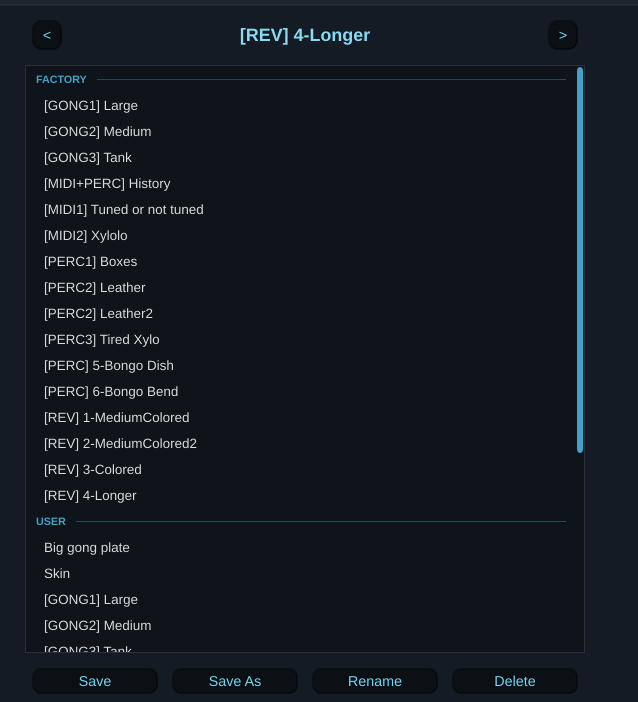

The top bar carries the standard FX-Mechanics preset strip (previous / next / name / save) and a triangle button opening the browser over the working area. User presets live in the per-product folder (`~/.config/ModalDish/Presets` on Linux, `~/Library/Application Support/ModalDish/Presets` on macOS, `%APPDATA%\ModalDish\Presets` on Windows), and any `.xml` dropped into [`Source/Presets/`](Source/Presets/) is embedded as a factory preset.

### The factory set

Sixteen presets ship with the plugin, and the prefix in the name says what kind of patch it is.

| Prefix | | What it is |
| --- | --- | --- |
| **GONG** | 3 | Large struck plates with *Cascade* up, so hard hits brighten into shimmer. |
| **PERC** | 6 | Shorter struck sounds: boxes, two leather patches, a xylophone and two bongos. The bongos run with the cascade off. |
| **MIDI** | 2 | Made to be played from a keyboard. *Freq Chan* is on, so notes retune the whole plate. |
| **MIDI+PERC** | 1 | Sources mapped to notes for striking, with a tuning channel as well. |
| **REV** | 4 | Effect presets. *In Gain* is raised, so audio sent to the plugin passes through the plate and comes back coloured by it. |

The REV presets are not attempts at a plate reverberator. An EMT 140 carries something like 1.3 modes per hertz [[2]](#references), which is why a real plate sounds diffuse instead of pitched. ModalDish spaces its modes at roughly 0.64 times the *Frequency* setting, so matching that density means running *Frequency* down around 1 Hz, and 1024 modes at that spacing reach only about 800 Hz. Filling the audible band as densely would take some 26,000 of them. Bank size buys frequency range and not density, because the tail continues at the plate's own spacing instead of filling in between, so the two demands pull against each other. These presets colour what you send them rather than diffuse it.

Bank sizes run from 474 to 1024 modes. Each preset carries its own geometry and modal data, so loading one puts its plate on screen and in the audio path with no solve.

They are starting points. Opening a preset's shape in *Modal design* and pulling it about costs one *Compute*, and the same settings on a different outline give a different instrument.

### What a preset, and a session, actually contain

Three things, and they are the same three whether the state is being written into a preset file or into a DAW session. Both travel by the same route, so neither can carry something the other does not.

| | Stored | Restored |
| --- | --- | --- |
| **Parameters** | every knob, switch and mapping | directly, on load |
| **Geometry** | the outline, the segment positions and their boundary conditions | the mesh is rebuilt from it (fast, milliseconds) |
| **Modal data** | the eigenvalues, the tension sensitivities, the mode shapes and the statistical tail | published straight to the audio thread, with no eigensolve |

The mesh is not stored, because it can be rebuilt with the geometry data.

The **modal data is stored** to save computation time on reload. It is one float per mesh vertex per mode (about 0.1 MB for the shipped plate at *Grid* 16, 1.4 MB for it at *Grid* 48, and 2.2 MB for the largest plate the canvas holds at *Grid* 48). The state is gzipped on the way out.

That is a large preset by the standards of a plugin whose parameters would fit in a few kilobytes.

The eigensolver computation is still there as the fallback, and runs in the background the way the *Compute* button does, when the cache is missing (a preset saved before its plate was ever computed) or does not match the mesh the geometry rebuilds to. That is the one case where a loaded plate is briefly silent, and the progress bar says so.

## Building

JUCE 8 is expected as a sibling directory (`../JUCE`); FxmeTools is a git
submodule:

```sh
git clone --recurse-submodules <this repo>
cmake -B Builds
cmake --build Builds -j2 --target ModalDish_VST3
```

Console validation suites:

```sh
cmake -B Builds -DMODALDISH_BUILD_TESTS=ON
cmake --build Builds -j2 --target FemTests
ctest --test-dir Builds
```

`ShapeFileTests` is the one suite that links JUCE (juce_core only, for its
JSON parser); the rest are JUCE-free and run without a plugin host.

Building does not install. Copy the `.vst3` into the folder your host scans
and make it rescan.

## Repo layout

| Path | Contents |
| --- | --- |
| `Source/PluginProcessor.*` | parameters, background compute, model publication, audio |
| `Source/Dsp/PlateSynth.*` | modal resonant filter bank (audio thread) |
| `Source/Dsp/ModalModel.h` | immutable mesh + modes shared with the audio thread |
| `Source/Components/ShapeCanvas.*` | shape drawing / boundary editing component |
| `Source/Components/PlatePointPanel.h` | the pickup and source panels |
| `Source/ShapeFile.*` | JSON geometry reader (see `Shapes/`) |
| `Source/PluginEditor.*` | FX-Mechanics UI (top bar, panels, plate view) |
| `lib/FxmeTools/core/FxmeTools/acoustics/` | reusable FEM library (mesh, Morley plate solver) |
| `lib/FxmeTools/core/FxmeTools/math/` | the linear algebra under it (sparse/dense storage, Cholesky, subspace eigensolver) |
| `lib/FxmeTools/FxmeTools/acoustics/` | the contour and 3D plate view components |
| `Tests/FemTests.cpp` | numerical validation against analytic plates |
| `Tests/IoTests.cpp` | source mappings, pickup mix, stereo tail |
| `Tests/CascadeMeasure.cpp` | cascade level and sample-rate independence |
| `doc/technical.tex` | the method, in full |
| `doc/starting_spec.md` | the original design brief |

## References

1. S. Bilbao, C. Webb, Z. Wang, M. Ducceschi, "Real-time gong synthesis", *Proceedings of the 26th International Conference on Digital Audio Effects (DAFx23)*, Copenhagen, 2023. A direct time-domain solution of the von Kármán plate, fast enough to run live on a rectangular domain. This is the approach the two nonlinearities here approximate.

2. K. Arcas, A. Chaigne, "On the quality of plate reverberation", *Applied Acoustics*, 2010. Modal density, damping and diffusion measured on a real plate reverberator.

The derivation behind ModalDish, with its own bibliography, is in the [technical doc repo](https://github.com/odoare/ModalDishPaper).

## License

AGPL-3.0-or-later, or commercial terms for holders of a commercial JUCE
licence - see [LICENSE.md](LICENSE.md) for the details and the four
framework-free files that stay LGPL-3.0-or-later.

The finite-element mesher and the Morley plate eigensolver are not in this
repository: they live in the framework-free half of [FxmeTools](https://github.com/odoare/FxmeTools) under LGPL-3.0-or-later, and can be used without JUCE.

---
Author: Olivier Doaré · FX-Mechanics · AGPL-3.0-or-later OR LicenseRef-FXME-Commercial
