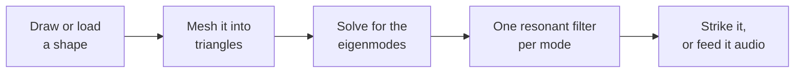
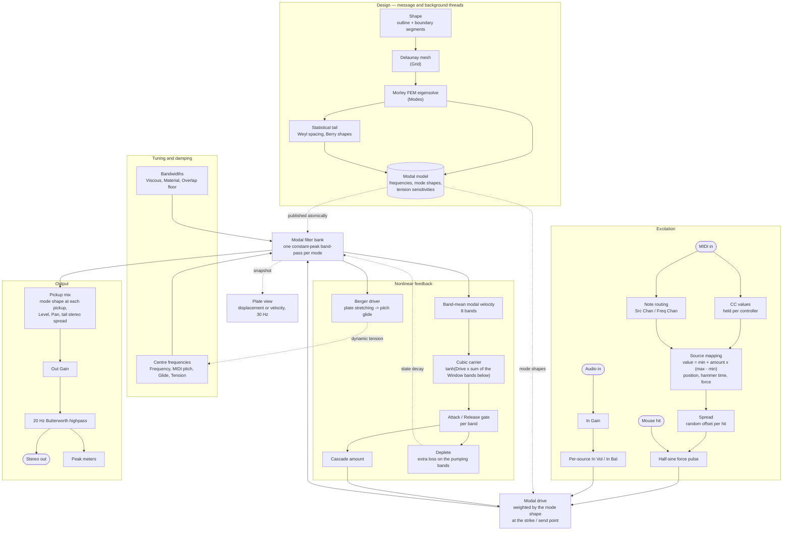
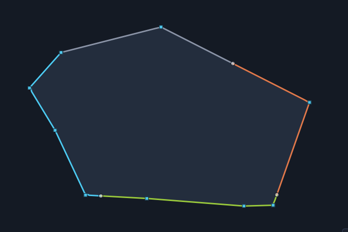

# ModalDish

FX-Mechanics plugin: a physical model of a **plate of arbitrary shape**,
solved by finite elements and played as an instrument (strike it) or used as
an effect (feed it audio).


Draw a shape, cut its border into segments and give each one a boundary
condition, press *Compute*, and the plugin solves the plate's eigenmodes and
turns them into a bank of resonant filters. From there it is an instrument:
hit it with the mouse, play it from MIDI, or send a signal through it.

Nothing is sampled and nothing is convolved. The plate exists as a set of
modes that the geometry actually produced, so moving the strike point, the
pickup, the tension or the damping changes the sound the way it would change
a real plate, and two geometric nonlinearities give it the pitch glide and
the shimmer that a linear filter bank cannot.

---

## Contents

- [How it works](#how-it-works)
- [Signal path](#signal-path)
- [Installing](#installing)
- [The interface](#the-interface)
- [Parameters](#parameters)
- [Playing it](#playing-it)
- [Loading a geometry from a file](#loading-a-geometry-from-a-file)
- [Presets](#presets)
- [Building](#building)
- [Repo layout](#repo-layout)
- [License](#license)

---

## How it works

A plate does not vibrate in one piece. It vibrates in **modes**: standing
patterns, each with its own frequency and its own map of where the plate
moves and where it stays still. Strike a plate and you excite every mode that
happens to be moving at the point you struck; listen at a point and you hear
every mode that is moving *there*. That is the whole instrument, and it is
why hitting a cymbal near the rim and near the bell give two different
sounds.

For a circle or a rectangle those modes have closed-form answers. For a shape
you drew by hand they do not, so ModalDish computes them:



1. **The shape** is a closed outline with a boundary condition on each part of
   its edge: clamped, simply supported, sliding, or free. The edge matters as
   much as the outline does, because it is what the modes have to satisfy.
2. **The mesh** cuts the interior into triangles (the *Grid* control sets how
   fine). Straight edges stay straight, corners stay corners.
3. **The eigensolve** finds the first N modes of that mesh: for each one a
   frequency and a shape (how much each point of the plate moves). This is the
   slow step, a few seconds, and it runs in the background while the previous
   plate keeps sounding.
4. **The filter bank** is one constant-peak band-pass per mode. Mode *k* gets
   its centre frequency from the eigenvalue and its bandwidth from the damping
   controls. A strike at point **x** feeds every filter in proportion to how
   much mode *k* moves at **x**; a pickup at point **y** sums every filter in
   proportion to how much mode *k* moves at **y**. Position is not an effect
   bolted on afterwards, it is the two weightings.
5. **Above the computed modes**, the bank is filled out to as many as 1024
   with a *statistical tail*: synthetic modes with the spacing a plate of that
   area really has and randomised shapes. It costs nothing to solve and it
   gives the nonlinearities somewhere to put their energy up to Nyquist.

Two things then make it behave like a plate rather than like a filter bank.

**Dynamic tension.** A real plate that is bending hard is also being
stretched, which stiffens it and raises its pitch. The *Nonlinear* control
turns that on: the whole spectrum glides up on a hard hit and settles back
down as the plate rings out. It is the gong and floor-tom bend.

**Mode cascade.** A hard-driven plate also moves energy *upwards* through its
spectrum, which is where a crash cymbal's shimmer comes from. The *Cascade*
control runs an eight-band ladder in which each band is pumped by a cubic of
the bands below it, so loud hits brighten progressively and the effect
vanishes at low level. *Deplete* is the other half of the trade: while a band
pumps the ones above it, it loses that energy itself, so the lows audibly
hand over rather than ringing on underneath.

The full derivation (the Kirchhoff plate with tension, the Morley element,
the shift-invert subspace eigensolver, the Berger approximation, the cascade
ladder and the statistical tail) is in
[**doc/technical.pdf**](doc/technical.pdf). Every section below points at the
part of it that goes deeper.

## Signal path

The detailed path, from a note or a sample arriving to a sample leaving. The
grey block runs once per plate, off the audio thread; everything else runs
per sample.



The same diagram is in the technical paper (figure 1), where each block is
labelled with the section that derives it.

Three details worth reading off it:

- The cascade is driven by the plate's **motion over the whole plate**, not by
  what the pickups hear. A mode that is silent at a pickup is not silent on
  the plate, and the ladder should not think it is. The consequence is that
  moving a pickup changes what you hear of the shimmer without changing how
  much shimmer is made.
- **Out Gain comes before the highpass**, so nothing downstream of the plate
  can put subsonic energy back, and the meters read what actually leaves.
- The plate view is a snapshot of the same filter states the audio comes from,
  not a separate simulation.

## Installing

Builds are published on the releases page: a zip per platform, plus a `.pkg`
installer for macOS. VST3 and AU on macOS, VST3 on Windows and Linux, with a
standalone application everywhere.

### macOS

ModalDish is free software and is **not signed with an Apple Developer ID**
(that is a paid Apple subscription). macOS therefore marks anything downloaded
through a browser as untrusted, and the DAW skips it during its scan, usually
with no error at all: the plugin simply never appears.

After copying the bundles into place, run the lines matching what you
installed:

```sh
xattr -dr com.apple.quarantine /Library/Audio/Plug-Ins/VST3/ModalDish.vst3
xattr -dr com.apple.quarantine /Library/Audio/Plug-Ins/Components/ModalDish.component
```

Then rescan. If you used the `.pkg` and macOS refused to open it, right-click
it and choose Open rather than double-clicking.

The builds are universal (Apple Silicon and Intel) and target macOS 10.13 and
later.

### Windows and Linux

Copy `ModalDish.vst3` into the VST3 folder your host scans
(`C:\Program Files\Common Files\VST3` on Windows, `~/.vst3` on Linux) and
rescan. Nothing else is needed.

## The interface

The window is 1022 by 760 (1142 with the Cascade column open) and has three
parts: the FX-Mechanics top bar, the plate area on the left, and the control
panels on the right.

The plugin has **two modes**, and the panels on screen are the ones belonging
to the mode you are in. *Modal design* is what the plate **is**; *Perform* is
how you play it. The buttons for both are in the strip under the plate, along
with *Compute*, the progress bar and the status line.

The split is not cosmetic. *Modes* reallocates and retunes the entire filter
bank, and raising it while the plate is ringing can produce a very loud
transient, so it lives on the design side where you are not playing.

Closing the plugin window and reopening it is a no-op: the mode you were in,
the view you had selected, the tool, the Cascade column and the angle you had
turned the 3D plate to all come back as you left them. None of that is in the
preset or in the session, on purpose. It describes a window rather than a
sound, so recalling a preset never moves the interface about, and a reloaded
session opens on the defaults.

### Modal design


The MODAL DESIGN panel holds a tool selector, a *Load* button, and four
controls. The mesh is rebuilt as you edit and drawn under the outline, so the
grid is always in front of you, and the boundary-condition key sits in the
corner of the sketch itself.

| Tool | What it does |
| --- | --- |
| **Draw shape** | Freehand. Drag a closed curve; it is smoothed with a closed spline and resampled to 128 points. |
| **Place points** | A polygon, vertex by vertex. See below. |
| **Ellipse** / **Rectangle** | A standard shape from the *Aspect* control. |
| **Rotate** | Drag to turn the shape inside the canvas. |
| **Edit boundary** | Drag the segment dividers (*Points* sets how many) and click a segment to cycle its condition. |

Boundary conditions are ordered stiffest first, and colour-coded in the key:

| Condition | The edge is | Sounds |
| --- | --- | --- |
| **Clamp** | held flat and still | tight, high, short |
| **Support** | held still but free to tilt | the default, the drum-head case |
| **Slide** | free to move but held flat | low and hollow |
| **Free** | unconstrained | gong-like, the lowest modes of all |

Segments are stored as fractions of the perimeter, so they follow the outline
when you reshape it rather than sliding off it.

#### Place points

A polygon edited vertex by vertex, for when a shape wants exact corners
rather than a drawn curve.



- **Click** adds a vertex. Below three points you are building an open chain
  and the third closes it; once closed, a click inserts the new vertex into
  the **edge nearest the click**, which refines the outline instead of folding
  it over itself.
- **Drag** a vertex moves it. The mesh is rebuilt on release, not during the
  gesture.
- **Alt-click** a vertex deletes it; alt-clicking empty space does nothing.
  The last three are kept, since fewer than three is not a shape the mesher
  can take, so deleting down to a triangle and dragging it about is how you
  start over.

Switching to this tool **adopts whatever shape is already on screen**, so a
freehand blob or an ellipse can be taken over and edited. A dense outline is
first reduced to at most 20 vertices by Douglas-Peucker, which spends its
budget on the corners: a dense-sampled rectangle comes back as exactly its
four corners, while an ellipse holds its area to within 2%. Shapes already
made of a few vertices (a rectangle, or one loaded from a file) are adopted
untouched. Boundary conditions are carried as arc-length fractions, so they
survive the reduction.

### Compute

*Compute* runs the modal analysis in the background, shows a progress bar,
and drops you into Perform when it finishes. The plate goes on sounding the
previous model until the new one is ready, so editing never cuts the audio.

*Perform* on its own goes back to the last model computed, keeping the shape,
so a shape can be worked on across several passes without the plate ever
falling silent.

What a solve costs is set by the **mode count**, not by the *Grid* setting:
the matrices are sparse and the solver is not quadratic in mesh size. The
status line shows the projected memory footprint once it passes 48 MB.

### Perform


Click the plate to hit it. The view selector next to *Perform* chooses what
the plate area shows:

| View | Shows |
| --- | --- |
| **Modes** | one eigenmode at a time, picked by the *Mode* control beside it, with its frequency in the status line |
| **Displacement** | the live deflection of the sounding plate, at 30 Hz |
| **Velocity** | the same field one power of frequency higher, which weights the high modes up |
| **Displacement 3D** / **Velocity 3D** | the same two as a lit surface; drag to rotate, wheel to zoom |


The colour scale is held across frames, so a ring visibly cools as it decays
rather than being renormalised each frame: hard hits stay bright longer, and
heavy damping fades out in a second.

Velocity only looks different from displacement when high modes are actually
ringing. With the default 3 ms hammer the two are indistinguishable; at
0.3 ms the velocity field carries about twice the spatial detail. Neither
shows the cascade, whose shimmer lives in the statistical tail, and tail modes
have no mesh shape to draw.

### Markers: pickups and sources

The plate carries up to eight **pickups** (orchid circles, labelled 1-8) and
up to eight **sources** (teal circles, labelled a-h). Pickups are where you
listen; sources are where the plate gets hit and where the input goes in. A
disabled one is drawn as a faint ring rather than removed, so it can still be
found.

Out of the box, pickup 1 is on and centred at unity gain, and source *a* is on
and centred at full send: a single mono listening point and a single injection
point, which is what the plugin was before either became plural.

| Gesture | Effect |
| --- | --- |
| `1`-`8` / `a`-`h` with the mouse over the plate | put that pickup or source under the cursor, switching it on |
| `A`-`H` with the mouse over the plate | put that source's *velocity endpoint* under the cursor |
| click a marker | open its panel: every parameter of that one point |
| alt-click a marker | switch it off |
| click anywhere else | hit the plate there, with the global *Duration* and *Force* |
| right-click / ctrl-drag | move pickup 1 |

A hit flashes a white ring where it actually landed, sized by how hard the
plate was struck. A source with *Spread* visibly scatters, and a note firing
several sources flashes each.

The **TRANSDUCERS** panel repeats those sixteen markers as two rows of
switches, pickups above and sources below, drawn as the very markers they
control so the rows read as a picture of what is currently on. They are the
same parameters as the *On* button in a marker's own panel and as alt-click on
the plate, so all three always agree.

### Marker panels

Clicking a marker opens its panel over the plate.


A **pickup** panel has X, Y, Level, Pan, On, and a meter of what that point is
hearing: mono, with its Level applied and its Pan not, so it answers how much
this pickup is picking up rather than where that lands in the image. Only the
pickup whose panel is open is metered, so the reading costs one multiply-add
per mode while a panel is up and nothing at all otherwise.


A **source** panel is a five-by-three grid, plus a *Note* box and a *MIDI
learn* button in the footer. Three of its quantities are **mapped**: where it
strikes, how long the hammer stays in contact, and how hard. Each is a
*min* / *max* pair plus a *Control* choosing what moves between them. See
[Source mappings](#source-mappings).

### Meters

Every meter in the plugin reads **peak**, held and then falling at 20 dB per
second, and the hold is computed alongside the audio rather than by the
editor, so a transient cannot slip between two GUI frames. Peak rather than
RMS because a struck plate is peaky: its short-term RMS runs 8 to 12 dB under
its sample peak, so an RMS bar would read +3 while the output was really at
+13.

The two IO meters read the master pair, post *Out Gain* and post highpass:
what actually leaves.

## Parameters

Ranges and defaults as shipped. The rightmost column points into
[doc/technical.pdf](doc/technical.pdf).

### MODAL DESIGN

| Control | Range | Default | What it does |
| --- | --- | --- | --- |
| **Aspect** | 0.25 - 4 | 1.2 | width-to-height of the *Ellipse* and *Rectangle* tools |
| **Points** | 1 - 12 | 4 | number of boundary segments the edge is cut into |
| **Grid** | 8 - 48 | 16 | mesh density (elements across the plate). Finer is more accurate, not more modes. |
| **Modes** | 1 - 1024 | 192 | size of the filter bank. Past the computed FEM count (up to 256) the rest is the statistical tail. |

*Grid* and *Modes* are the two halves of the cost. Accuracy comes from *Grid*;
range and shimmer density come from *Modes*. The bank only processes modes
below Nyquist, so at a high *Frequency* setting a large bank costs nothing past
the point where the spectrum runs out.

Because the tail continues at the plate's own spacing, bank size buys **range,
not density**: added modes go above the ones already there rather than between
them. What that range is for is the bottom of the *Frequency* range, where the
plate used to run out of spectrum well below Nyquist.

> Technical paper: *Mesh generation*, *The eigenvalue problem*, *The
> statistical mode tail*.

### FREQUENCY CONTROL


| Control | Range | Default | What it does |
| --- | --- | --- | --- |
| **Frequency** | 1 - 2000 Hz | 110 Hz | where mode 1 lands. Everything else follows the ratios the geometry gives it. |
| **Glide** | 0.1 - 100 ms | 0.1 ms | portamento between MIDI-tuned notes |
| **Src Chan** | Omni, 1 - 16 | Omni | the MIDI channel that triggers |
| **Freq Chan** | Off, 1 - 16 | Off | the MIDI channel that tunes |
| **Unmapped note hits** | on / off | on | what a note no source claims does |

*Frequency* reaches down to 1 Hz, where most of the bank falls below the 20 Hz
audibility floor and is muted outright, leaving a sparse high spectrum. The
output carries a fixed second-order Butterworth highpass at 20 Hz so that what
the low settings do not use never reaches a woofer. It is 3 dB down at 20 Hz,
12 dB/oct below, and has a double zero at DC, so an offset is removed
absolutely rather than attenuated; above 35 Hz it is within 0.4 dB of flat.

*Glide* is a time and not a rate, and the travel is logarithmic, so a glide
takes the same time whatever the interval. It is a time in seconds rather than
in samples, so it lasts as long at 96 kHz as at 48.

> Technical paper: *Playing the plate: notes, channels and glide*.

### DYNAMICS


| Control | Range | Default | What it does |
| --- | --- | --- | --- |
| **Tension** | 0 - 500 | 0 | tension against flexural stiffness. 0 is a pure plate; large is membrane-like. |
| **Nonlinear** | 0 - 1 | 0 | dynamic tension: pitch glides up on a hard hit |
| **Viscous** | 1e-6 - 0.1 | 1e-4 | damping through the plate's velocity |
| **Material** | 1e-6 - 0.1 | 7e-6 | damping through internal friction |
| **Cascade** | 0 - 1 | 0 | amount of upward energy transfer, and its off switch |
| **Deplete** | 0 - 1 | 0.07 | how much the pumping bands lose in return |
| **A >** | | closed | opens the CASCADE column |

**Tension** retunes the bank at audio rate: the eigenproblem is solved at
whatever tension was set when *Compute* ran, and moves around it follow a
first-order law. Press *Compute* again for exactness at a very different
tension. Note that it keeps mode 1 pinned at *Frequency* and reshapes the
ratios only, where *Nonlinear* moves the whole spectrum including the
fundamental.

**Viscous** and **Material** are both the damping ratio of mode 1, and they
differ in what they do to everything above it: viscous damping decays
relatively slower for high modes, material damping faster. Material's law is
steep enough that the shipped 7e-6 is already most of what the top octave will
take.

**Nonlinear** is calibrated in audible glide rather than in plate units, so
the same setting bends by about the same amount on any shape. The whole
spectrum rises on a hard hit and relaxes as the plate rings out.

**Cascade** at 0 is off in a stronger sense than just silent: the *Overlap*
bandwidth floor is scaled by the amount too, so at 0 the target modes keep the
plate's own damping instead of being quietly widened while nothing is being
pumped.

> Technical paper: *Frequency and damping laws*, *Dynamic tension: the Berger
> approximation*, *Mode cascade: a multi-band cubic ladder*.

### CASCADE (the **A >** column)


These voice the ladder rather than sizing it. Useful workflow: set them with
*Cascade* already up, then bring *Cascade* to where you want it.

| Control | Range | Default | What it does |
| --- | --- | --- | --- |
| **Drive** | 0.1 - 30 | 8 | the tanh knee: what the carrier is *made of* |
| **Window** | 1 - 7 | 4 | how many bands below each band pump it |
| **Attack** | 1 - 1000 ms/band | 30 | gate attack, growing with the band's height |
| **Release** | 20 - 4000 ms | 2000 | gate release: how the pumping tails off |
| **Overlap** | 0 - 1 | 0.1 | bandwidth floor on the receiving modes |

Two things about **Drive**. It is not gradual: at *Cascade* 1 and the shipped
*Force*, everything from 0.1 to 4 is silent and 4 to 16 covers 76 dB. And
where that window sits depends on how hard you play, because the tanh knee
does: 8 matches the voiced sound at *Force* 1, 6 at *Force* 6, 4 at
*Force* 15.

The band graph is a strict DAG (no band pumps itself, directly or indirectly),
so the ladder is unconditionally stable with no gain restriction to respect.

Every duration here means the same thing at any sample rate: they are stored
in seconds and converted when the rate is known.

> Technical paper: *Mode cascade: a multi-band cubic ladder*.

### HAMMER CONTROL


| Control | Range | Default | What it does |
| --- | --- | --- | --- |
| **Duration** | 0.1 - 50 ms | 3 ms | length of the half-sine shock |
| **Force** | 0 - 20 | 1 | its amplitude |

These are the *global* hammer, used by a mouse click on bare plate and by a
MIDI note no source claims. A source has its own pair, and its own mapping for
each. Short and hard is a stick; long and soft is a mallet.

*Force* goes well past unity because with the nonlinearities engaged the
absolute level matters (it drives both of them). Nothing downstream is
unbounded in it: the linear bank is linear in the force, the Berger driver
saturates well below *Force* 5, and the tanh holds the cascade carriers to
plus or minus one. What a hard hit buys past that point is the gating and the
depletion, not more level.

> Technical paper: *Excitation, pickup, gain compensation*.

### IO


| Control | Range | Default | What it does |
| --- | --- | --- | --- |
| **In Gain** | 0 - 2 | 0 | how much of the plugin input reaches the sources |
| **Out Gain** | -36 - +12 dB | 0 dB | master level, before the highpass |

*In Gain* at 0 is the instrument case: nothing goes in and the plate is played
by strikes alone. Raise it to use ModalDish as an effect.

### Pickup panel

| Control | Range | Default | What it does |
| --- | --- | --- | --- |
| **X**, **Y** | 0 - 1 | pickup 1 at centre | where on the plate this pickup listens |
| **Level** | -60 - +12 dB | 0 dB | its contribution to the mix |
| **Pan** | -1 - +1 | pickup 1 centred | equal-power, with the centre at unity |
| **On** | | pickup 1 only | |

Pan is equal-power with the centre at unity, so a centred pickup at 0 dB is
exactly what a single mono output would be. The pickups are a linear mix, so
the audio loop costs the same whether one is on or eight.

Positions matter most for the low modes, where a handful of mode shapes give
each point its own emphasis. High in the spectrum, hundreds of positive terms
converge to nearly the same value wherever the pickup sits, which is why the
statistical tail carries its own stereo spread instead (see the technical
paper).

> Technical paper: *Excitation, pickup, gain compensation*, *Stereo placement
> of the tail*.

### Source panel

The grid, left to right and top to bottom:

| | | |
| --- | --- | --- |
| X1 | Y1 | Spread |
| X2 | Y2 | Pos Ctl |
| Ham Min | Ham Max | Ham Ctl |
| Frc Min | Frc Max | Frc Ctl |
| Curve | In Vol | In Bal |

| Control | Range | Default | What it does |
| --- | --- | --- | --- |
| **X1**, **Y1** | 0 - 1 | source *a* at centre | where this source strikes at zero control |
| **X2**, **Y2** | 0 - 1 | on top of X1/Y1 | where it strikes at full control |
| **Spread** | 0 - 0.25 | 0 | standard deviation per axis of a random offset on every hit |
| **Ham Min** / **Ham Max** | 0.1 - 50 ms | 3 ms | this source's hammer duration, at zero and full control |
| **Frc Min** / **Frc Max** | 0 - 20 | 0 and 1 | its force, at zero and full control |
| **Pos Ctl** | Off / Vel / CC 0-127 | Vel | what moves the strike point |
| **Ham Ctl** | Off / Vel / CC 0-127 | Off | what moves the hammer duration |
| **Frc Ctl** | Off / Vel / CC 0-127 | Vel | what moves the force |
| **Curve** | Slow / Linear / Fast | Linear | shape applied to velocity before it drives anything |
| **In Vol** | 0 - 2 | source *a* at 1 | this source's share of the plugin input |
| **In Bal** | -1 - +1 | 0 | which side of the incoming stereo pair it takes |
| **Note** | Off, C-1 - G9 | Off | the MIDI note this source answers to |
| **On** | | source *a* only | |

*Spread* scatters around wherever the mapping placed the hit, not around the
base point, so a moving strike point and a scattered one compose.

The shipped defaults (*Frc Min* 0, *Frc Max* 1, *Frc Ctl* Vel) are exactly
"velocity scales force", which is what the hammer did before any of the
mapping existed.

Only strikes follow the mappings. The audio input is injected at the *X1*/*Y1*
point alone, a continuous signal having no velocity to place it by.

## Playing it

### With the mouse

Click anywhere on the plate that is not a marker and it is struck there, with
the global *Duration* and *Force*. That is the fastest way to audition a
shape, and it is what the design and compute cycle is built around.

### Source mappings

Each source has three quantities that a control can move: **where** it
strikes, **how long** the hammer is in contact, and **how hard**. Each is a
min/max pair and a *Control*.

The value used for a strike is

```
value = min + amount x (max - min)
```

where *amount* runs 0 to 1 and comes from the *Control*:

- **Off** holds the quantity at its *min*.
- **Vel** uses the triggering note's velocity, shaped by *Curve*. *Slow*
  squares it (a hard hit is needed before much happens), *Fast* takes its root
  (it responds early), *Linear* is the identity.
- **A CC number** is taken as the player's hardware left it, uncurved, and is
  read at strike time from the sources' MIDI channel. A controller that has
  never moved reads zero, holding the min.

**Min is not required to be below max.** Putting it above simply inverts the
mapping, so a source can hit *softer* the harder it is played, or move toward
the rim as a pedal is released.

The three controls are independent: position can follow a pedal while force
follows velocity.

**Position** is the segment drawn on the plate. The lower-case marker (*a*) is
the *min* end and the upper-case one (*A*) the *max*. Played across the range,
the plate is struck in different places, nearer the rim or nearer the centre,
which is what a real player does and a fixed point cannot imitate.

Both endpoints start on top of each other, so a source is a plain point until
you pull it apart, and dragging the marker then moves the whole thing. To
separate them, hover the plate and press the **capital** letter (`A`-`H`) to
drop the *A* end under the cursor, or use the *X2* / *Y2* boxes. The two are
then joined by a thin line and drag independently.

### From MIDI

A note does two independent things: it **triggers** and it **tunes**. Which of
them a given note does is decided by the two channel controls, so the same
keyboard can do both, or two controllers can split the job.

**Src Chan** (default *Omni*) is the channel that triggers. A note on it fires
every enabled source mapped to that note. Note-offs are ignored: a struck
plate rings out on its own, so the decay is the damping, not the key.

**Unmapped note hits** says what a note on that channel does when no source
claims it: strike the last touched point with the global *Duration* and
*Force*, or nothing. On is what makes the plugin playable from a keyboard
before any source is mapped. Switch it off once every note is mapped, so a
stray one stays silent rather than hitting wherever the mouse last was.

**Freq Chan** (default *Off*) is the channel that tunes. A note on it moves
the plate so **mode 1 lands on the note**, the rest of the spectrum following
the ratios the geometry and boundary conditions give it. It ships Off, so
notes only trigger until you assign it. Set both controls to the same channel
(or leave *Src Chan* on Omni) to play the plate as one instrument, or give
them different channels to retune it from a second controller without
striking.

Two things deliberately never glide: the *Frequency* control, which sets the
pitch outright, and the first note after loading, which lands in tune instead
of swooping up from wherever *Frequency* happened to sit.

**MIDI learn.** A source's panel carries a Learn button: arm it and the next
note received is captured as that source's note, and swallowed, so learning
never costs you a stray hit. Clicking it again, or closing the panel, gives
up.

Hosts differ on whether an audio effect can receive MIDI at all:

| Host | How |
| --- | --- |
| REAPER | Any track; MIDI on it reaches the plugin directly. |
| Ableton Live | **Cannot** route MIDI to an audio effect on an audio track. Put ModalDish on a MIDI track *after* an instrument. |
| Bitwig / Studio One / Cubase | Route a MIDI track's output to the plugin (note-input assignment). |
| Logic | Use the AU: it appears under *MIDI-controlled Effects*, not Audio FX. |

If nothing seems to arrive, watch the plate: a note that lands flashes the
same ring a mouse click does.

### As an effect

Raise *In Gain* and the plugin input is injected into the plate at each
enabled source's *X1*/*Y1* point, with that source's *In Vol* and *In Bal*.
The plate then acts as a resonant body over whatever you send it, and the
strike controls still work on top, so it can be excited by both at once.

## Loading a geometry from a file

*Load* (beside the tool selector, in design mode) reads a plate outline from a
JSON file. The shape lands **in the canvas** as an ordinary editable one:
points can be dragged, segments re-cut, conditions cycled, and nothing is
computed until you press *Compute*.

```json
{
  "modaldish_shape": 1,
  "name": "Trapezoid gong",
  "meshDensity": 20,
  "points": [
    [-0.85, -0.55],
    [ 0.85, -0.55],
    [ 0.55,  0.75],
    [-0.55,  0.75]
  ],
  "boundary": { "2": "support" }
}
```

- `points` — (x, y) pairs in [-1, 1] with **y up** (the mathematical
  convention, not the screen one), joined in order and closed from the last
  back to the first. Straight edges: the mesher resamples them and keeps any
  turn sharper than 30 degrees as a corner, so four points really is a valid
  file. The full [-1, 1] range maps onto the same margin box a drawn shape is
  fitted into. A shape that uses less of the range stays proportionally
  smaller rather than being stretched to fill, which also means it gets
  proportionally fewer elements, since *Grid* sets an absolute element size.
- `boundary` — optional, maps a **point index** to the condition starting at
  that point. A point that is not listed inherits the condition of the
  previous listed one, wrapping around from the end, so the example above is
  supported from point 2 round to point 1. Names are case-insensitive and
  accept the obvious variants (`clamp`/`clamped`, `support`/`simplysupported`,
  `slide`/`sliding`, `free`); a bare 0-3 works too. Omit the key entirely for
  a simply supported edge all round.
- `meshDensity` — optional, 8 to 48, the same number the *Grid* control sets.
- `name` and `modaldish_shape` are carried but not required.

A malformed file is refused with a message naming what is wrong and where (the
offending point index, the unknown condition, the out-of-range key) rather
than loading a half-shape. Examples live in [`Shapes/`](Shapes/).

## Presets


The top bar carries the standard FX-Mechanics preset strip (previous / next /
name / save) and a triangle button opening the browser over the working area.
User presets live in the per-product folder (`~/.config/ModalDish/Presets` on
Linux, `~/Library/Application Support/ModalDish/Presets` on macOS,
`%APPDATA%\ModalDish\Presets` on Windows), and any `.xml` dropped into
[`Source/Presets/`](Source/Presets/) is embedded as a factory preset.

### What a preset, and a session, actually contain

Three things, and they are the same three whether the state is being written
into a preset file or into a DAW session. Both travel by the same route, so
neither can carry something the other does not.

| | Stored | Restored |
| --- | --- | --- |
| **Parameters** | every knob, switch and mapping | directly, on load |
| **Geometry** | the outline, the segment positions and their boundary conditions | the mesh is rebuilt from it (fast, milliseconds) |
| **Modal data** | the eigenvalues, the tension sensitivities, the mode shapes and the statistical tail | published straight to the audio thread, with no eigensolve |

The **mesh is not stored**, because it does not need to be: it is a
deterministic function of the outline and *Grid*, both of which are, so
rebuilding it costs less than reading it would. Only its vertex count travels,
as a check that the stored mode shapes are indexed against the mesh that comes
back.

The **modal data is stored**, which is the part worth knowing about, because
it is what a plate costs to compute. It is one float per mesh vertex per mode:
about 0.1 MB for the shipped plate at *Grid* 16, 1.4 MB for it at *Grid* 48,
and 2.2 MB for the largest plate the canvas holds at *Grid* 48. The state is
gzipped on the way out, which almost exactly cancels the base64 the blocks are
written as, so those are also the figures that reach the disk.

That is a large preset by the standards of a plugin whose parameters would fit
in a few kilobytes, and it is worth it: without the cache, loading a preset
means waiting out an eigensolve, which is seconds at a modest *Grid* and tens
of seconds at the top of the range. There is no previous model to go on
sounding on a fresh load, so that wait is silence. With the cache the plate
sounds as soon as the preset lands.

The eigensolve is still there as the fallback, and runs in the background the
way the *Compute* button does, when the cache is missing (a preset saved
before its plate was ever computed) or does not match the mesh the geometry
rebuilds to. That is the one case where a loaded plate is briefly silent, and
the progress bar says so.

## Building

JUCE 8 is expected as a sibling directory (`../JUCE`); FxmeTools is a git
submodule:

```sh
git clone --recurse-submodules <this repo>
cmake -B Builds
cmake --build Builds -j2 --target ModalDish_VST3
```

Console validation suites:

```sh
cmake -B Builds -DMODALDISH_BUILD_TESTS=ON
cmake --build Builds -j2 --target FemTests
ctest --test-dir Builds
```

`ShapeFileTests` is the one suite that links JUCE (juce_core only, for its
JSON parser); the rest are JUCE-free and run without a plugin host.

Building does not install. Copy the `.vst3` into the folder your host scans
and make it rescan.

## Repo layout

| Path | Contents |
| --- | --- |
| `Source/PluginProcessor.*` | parameters, background compute, model publication, audio |
| `Source/Dsp/PlateSynth.*` | modal resonant filter bank (audio thread) |
| `Source/Dsp/ModalModel.h` | immutable mesh + modes shared with the audio thread |
| `Source/Components/ShapeCanvas.*` | shape drawing / boundary editing component |
| `Source/Components/PlatePointPanel.h` | the pickup and source panels |
| `Source/ShapeFile.*` | JSON geometry reader (see `Shapes/`) |
| `Source/PluginEditor.*` | FX-Mechanics UI (top bar, panels, plate view) |
| `lib/FxmeTools/core/FxmeTools/acoustics/` | reusable FEM library (mesh, Morley plate solver) |
| `lib/FxmeTools/core/FxmeTools/math/` | the linear algebra under it (sparse/dense storage, Cholesky, subspace eigensolver) |
| `lib/FxmeTools/FxmeTools/acoustics/` | the contour and 3D plate view components |
| `Tests/FemTests.cpp` | numerical validation against analytic plates |
| `Tests/IoTests.cpp` | source mappings, pickup mix, stereo tail |
| `Tests/CascadeMeasure.cpp` | cascade level and sample-rate independence |
| `doc/technical.tex` | the method, in full |
| `doc/starting_spec.md` | the original design brief |

## License

AGPL-3.0-or-later, or commercial terms for holders of a commercial JUCE
licence - see [LICENSE.md](LICENSE.md) for the details and the four
framework-free files that stay LGPL-3.0-or-later.

The finite-element mesher and the Morley plate eigensolver are not in this
repository: they live in the framework-free half of
[FxmeTools](https://github.com/odoare/FxmeTools) under LGPL-3.0-or-later, and
can be used without JUCE.

---
Author: Olivier Doaré · FX-Mechanics · AGPL-3.0-or-later OR LicenseRef-FXME-Commercial
