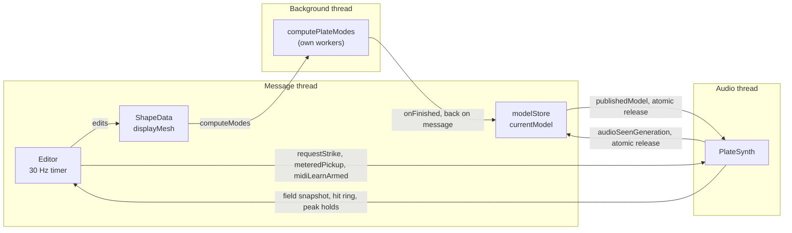

# ModalDish: threading and data-flow architecture

What runs on which thread, what crosses between them and by what mechanism,
and which invariants a change must not break. Written to be read cold, by a
person or by an assistant, before touching `Source/`.

The physics and the numerics are not here. They are in the technical paper
(separate repository). This file is only about the machinery that carries
them.

**Keep this file current.** A new cross-thread channel, a new parameter, or a
change to how the model is published belongs here on the same commit.

---

## 1. Threads

| Thread | Owns | Never does |
| --- | --- | --- |
| **Audio** | `PlateSynth`'s filter states, hammer slots, cascade and Berger state, the output highpass and the meters | allocate, lock, take a `shared_ptr` copy, write a parameter, touch `ShapeData`, `displayMesh` or `modelStore` |
| **Message** | `ShapeData`, `displayMesh`, `currentModel`, `modelStore`, the whole editor, the APVTS tree, all persistence | block on the audio thread |
| **Background** (`fxme::BackgroundTaskRunner`, 1 thread) | one running eigensolve, writing only into `pendingModel` | touch anything message-thread affine, including `modelStore` and the APVTS |
| **Eigensolver workers** | spawned inside `computePlateModes`, joined before it returns | outlive the solve |

`BackgroundTaskRunner::onFinished` runs back **on the message thread**, which
is what makes it the only safe place to publish a result.



---

## 2. Who owns what

State is single-owner unless a row below says otherwise. If you need a value
on another thread, add a channel from §3 rather than a second copy.

| State | Owner | Notes |
| --- | --- | --- |
| `ShapeData shapeData` | message | outline, segment starts, BCs, mesh density |
| `displayMesh` | message | `shared_ptr<const FemMesh>`, the *design* mesh |
| `modelStore` | message | owns every `ModalModel` ever published |
| `currentModel` | message | raw pointer into `modelStore`, or null when stale |
| `publishedModel` | **shared** | `atomic<const ModalModel*>`, the audio thread's only view |
| `ModalModel::mesh` | **shared** | `shared_ptr` snapshot taken at compute time; independent of `displayMesh` |
| `apvts` | message | parameters, plus the `SHAPE` and `MODES` children |
| `editorState` | message | window state, outlives the editor, never serialised |
| `PlateSynth` internals | audio | configured only through `update()` |

**Two meshes exist and that is deliberate.** `displayMesh` follows the shape
being edited; `model->mesh` is the one the sounding modes were computed
against. Editing replaces the first while the second stays alive by
refcount, which is what lets the plate go on sounding an old model while a
new shape is being drawn.

---

## 3. Cross-thread channels

Every one of these is lock-free. There is no mutex anywhere in the audio
path, and adding one would be a bug rather than a fix.

### Message → audio

| Channel | Mechanism | Invariant |
| --- | --- | --- |
| The model | `publishedModel`, release store | never freed while the audio thread may still hold it — see §4 |
| Parameters | APVTS `atomic<float>*`, read once per block into `PlateSynth::Params` | read at block start, never mid-block, so one block is one coherent setting |
| Strike request | `strikeCounter` (release) + `strikeX/Y/Vel` | counter is the commit; position is written first |
| Metered pickup | `atomic<int> meteredPickup` | `-1` means nothing is metered, which is the default |
| MIDI learn arm | `atomic<int> midiLearnArmed` | `-1` disarmed; the audio thread clears it on capture |

### Audio → message

| Channel | Mechanism | Invariant |
| --- | --- | --- |
| Generation ack | `audioSeenGeneration`, release store every block | the reclamation contract of §4 |
| Modal field | `fieldQ[]`, `fieldV[]` relaxed, `fieldCount` release, resampled every 32 samples | a reader may straddle two sampling instants; invisible in a picture, and it keeps the write lock-free |
| Hit ring | 16 slots of three relaxed atomics + `hitCount` release | a reader more than 16 hits behind loses the oldest; correct failure mode for decoration |
| Meters | `peakHoldL/R/Pickup`, relaxed | held and decayed **on the audio thread**, so a transient cannot fall between two GUI frames |
| MIDI learn capture | `midiLearnSource` then `midiLearnNote` (release) | the editor's timer applies it with `exchange`, so a note is applied once even under a race |

**Nothing writes a parameter from the audio thread.** MIDI learn is the case
that wants to: it captures into an atomic instead and lets the editor's timer
do the write.

---

## 4. The model lifecycle

The subtlest thing in the project. A `ModalModel` is megabytes of mode
shapes, the audio thread reads it through a bare pointer, and it must never
be freed while that pointer is live.

```
message                                    audio
-------                                    -----
publishModel(m)
  m->generation = nextGeneration++
  currentModel = m.get()
  modelStore.push_back(move(m))
  publishedModel.store(m, release)   -->   processBlock:
                                             model = publishedModel.load(acquire)
                                             audioSeenGeneration.store(
  reclaimModels(false)               <--        model->generation, release)
    seen = audioSeenGeneration.load(acquire)
    erase every stored model that is
      - not publishedModel
      - not currentModel
      - generation < seen
```

The rule: a model may be freed once the audio thread has **acknowledged a
newer generation**. Acknowledgement, not elapsed time, is what makes this
safe.

`releaseResources()` calls `reclaimModels(true)`, which treats every
generation as seen — legitimate there and nowhere else, because no
`processBlock` can run after it.

**If you change publication, preserve all three of:** the release/acquire
pair, the acknowledgement before freeing, and `modelStore` owning every model
rather than the audio thread owning any.

---

## 5. Parameters

`createLayout()` builds the APVTS; the processor caches an
`atomic<float>*` per parameter and reads them at the top of `processBlock`
into a `PlateSynth::Params` value.

`PlateSynth::update()` then diffs that against the previous `Params` and does
the least work that covers the difference:

| Changed | Work |
| --- | --- |
| model pointer | `reset()`, full `retune()` |
| base frequency, tension, damping, mode count, overlap, cascade amount | full `retune()` |
| pickup **position** | `computeOutputWeights()` — resample mode shapes |
| pickup level / pan / on | `updatePickupMix()` — collapse the mix only |
| source position | `computeSourceShapes()` |
| source send / balance / on | `updateSourceMix()` |
| cascade attack / release | `updateCascadeEnvelopes()` |
| injection switch | `updateCascadeWeights()` |

**Adding a parameter — the whole checklist:**

1. id in `Source/ParamIDs.h`
2. `createLayout()` in `PluginProcessor.cpp`
3. `atomic<float>*` member in `PluginProcessor.h`, bound in the constructor
4. read into `Params` in `processBlock`
5. field on `PlateSynth::Params`
6. **a diff branch in `PlateSynth::update()`** — miss this and the parameter
   is read but never acted on, which looks like a dead control
7. a control in the editor, added to the `designOnly` / `performOnly`
   visibility lists
8. the parameter table in `README.md`

Step 6 is the one that gets forgotten.

---

## 6. Persistence

`SHAPE` and `MODES` live **inside `apvts.state`**, because a preset carries
that tree and nothing else. `foldExtrasInto(tree)` refreshes both, and is
the only writer.

| Path | Folds into | Then |
| --- | --- | --- |
| Preset save | `apvts.state` (live) | `PresetManager` copies it |
| Session save | `apvts.copyState()` (a copy) | a host may call this off the message thread, so the live tree is not touched |

Load, both paths: restore parameters, rebuild the mesh from `SHAPE`, then try
`modesFromTree` and fall back to `computeModes()`. The mesh is never
serialised — `generateMesh` is deterministic in the outline and the density,
so only its vertex count travels, as a consistency check on what the stored
mode shapes are indexed against.

`editorState` is deliberately **not** serialised: it describes a window, not
a sound.

---

## 7. Audio-thread rules

A change that breaks one of these is a bug even if it sounds fine.

- **No allocation.** Every buffer is sized in `prepareToPlay`. The pickup
  meter scratch is checked against the block size and skipped rather than
  grown if a host exceeds what it promised.
- **No locks, no file or console I/O, no logging.**
- **No `shared_ptr` copies.** The mesh is reached through the raw model
  pointer precisely to avoid refcount traffic.
- **No parameter writes.**
- **Bounded work per sample.** The mode loop runs to `liveModes`, not
  `maxModes`: modes above Nyquist are muted and skipped.
- **Sample-rate independence.** Every duration is stored in seconds and
  converted in `prepare()`. A per-sample coefficient is a duration that
  halves when the rate doubles — this was a real bug, and
  `Tests/CascadeMeasure.cpp` renders at 48 and 96 kHz to keep it fixed.

---

## 8. Editor

One 30 Hz `juce::Timer` drives everything periodic: meters, the live field,
the hit ring drain, MIDI-learn application, the Glide enablement poll, and
the coalesced remesh.

**Remeshing is throttled through that timer**, not done per event. A remesh
runs 0.4 ms at Grid 16 and 7.6 ms at Grid 48, and both the mouse and a knob
drag deliver values faster than frames exist to show them. `ShapeCanvas` sets
`geometryDirty` during a drag and the editor keeps `meshDirty` for the Grid
knob; the timer drains both. Both flags are read *before* the test that uses
them, never inside it — a short-circuited `||` would leave one set and a
rebuild owing.

Editor lifetime is not session lifetime: the window is destroyed and rebuilt
on every close and reopen, which is why anything that must survive that lives
on the processor (`editorState`, `splashClaimed`).

---

## 9. File map

| Path | Role |
| --- | --- |
| `Source/PluginProcessor.{h,cpp}` | the hub: parameters, publication, persistence, MIDI routing, `processBlock` |
| `Source/Dsp/PlateSynth.{h,cpp}` | the whole audio thread |
| `Source/Dsp/ModalModel.h` | the immutable value type crossing to audio |
| `Source/ParamIDs.h` | ids and shared constants; JUCE-free |
| `Source/PluginEditor.{h,cpp}` | editor, timer, cross-thread reads |
| `Source/Components/ShapeCanvas.*` | shape editing; owns no processor state |
| `Source/ShapeFile.*` | JSON geometry reader |
| `lib/FxmeTools/core/…/acoustics` | mesher and eigensolver, JUCE-free |
| `Tests/CascadeMeasure.cpp` | offline render; the sample-rate and cascade guards |

`Source/ParamIDs.h`, `Source/Dsp/ModalModel.h`, `Tests/FemTests.cpp` and
`Tests/juce_stub/JuceHeader.h` are framework-free and LGPL — check
`LICENSE.md` before adding a JUCE include to any of them.

---

## 10. Invariant checklist

Run down this list when reviewing a change to the audio path or to
publication.

- [ ] No allocation, lock, or I/O reachable from `processBlock`
- [ ] Parameters read once per block, not per sample
- [ ] Every new `Params` field has a diff branch in `update()`
- [ ] A published model is freed only after a **newer** generation is acknowledged
- [ ] Release/acquire pairing on `publishedModel` and `audioSeenGeneration`
- [ ] New durations stored in seconds, converted in `prepare()`
- [ ] Audio→message readouts are atomics with a documented failure mode
- [ ] Nothing message-thread affine touched from a background job
- [ ] `editorState` still carries no sound-affecting value
- [ ] This file updated
