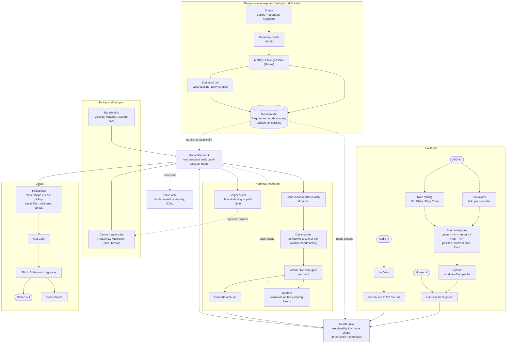

```mermaid
flowchart TB

  subgraph DESIGN["Design — message and background threads"]
    SHAPE["Shape<br>outline + boundary segments"]
    MESH["Delaunay mesh<br>(Grid)"]
    SOLVE["Morley FEM eigensolve<br>(Modes)"]
    TAILGEN["Statistical tail<br>Weyl spacing, Berry shapes"]
    MODEL[("Modal model<br>frequencies, mode shapes,<br>tension sensitivities")]
    SHAPE --> MESH --> SOLVE --> MODEL
    SOLVE --> TAILGEN --> MODEL
  end

  subgraph EXC["Excitation"]
    MIDIIN(["MIDI in"])
    CCTAB["CC values<br>held per controller"]
    ROUTE["Note routing<br>Src Chan / Freq Chan"]
    MAPPING["Source mapping<br>value = min + amount x (max - min)<br>position, hammer time, force"]
    SPREAD["Spread<br>random offset per hit"]
    PULSE["Half-sine force pulse"]
    MOUSE(["Mouse hit"])
    AUDIN(["Audio in"])
    INGAIN["In Gain"]
    SENDS["Per-source In Vol / In Bal"]
    MIDIIN --> CCTAB --> MAPPING
    MIDIIN --> ROUTE --> MAPPING --> SPREAD --> PULSE
    MOUSE --> PULSE
    AUDIN --> INGAIN --> SENDS
  end

  DRIVE["Modal drive<br>weighted by the mode shape<br>at the strike / send point"]
  BANK["Modal filter bank<br>one constant-peak band-pass per mode"]

  PULSE --> DRIVE
  SENDS --> DRIVE
  DRIVE --> BANK
  MODEL -. published atomically .-> BANK
  MODEL -. mode shapes .-> DRIVE

  subgraph TUNING["Tuning and damping"]
    OMEGA["Centre frequencies<br>Frequency, MIDI pitch, Glide, Tension"]
    ZETA["Bandwidths<br>Viscous, Material, Overlap floor"]
  end
  OMEGA --> BANK
  ZETA --> BANK

  subgraph FEEDBACK["Nonlinear feedback"]
    BANDS["Band-mean modal velocity<br>8 bands"]
    CUBIC["Cubic carrier<br>tanh(Drive x sum of the Window bands below)"]
    GATE["Attack / Release gate<br>per band"]
    AMOUNT["Cascade amount"]
    DEPLETE["Deplete<br>extra loss on the pumping bands"]
    BERGER["Berger driver<br>plate stretching -> pitch glide"]
    BANDS --> CUBIC --> GATE --> AMOUNT
    GATE --> DEPLETE
  end
  BANK --> BANDS
  BANK --> BERGER
  AMOUNT --> DRIVE
  DEPLETE -. state decay .-> BANK
  BERGER -. dynamic tension .-> OMEGA

  subgraph OUTPUT["Output"]
    PMIX["Pickup mix<br>mode shape at each pickup,<br>Level, Pan, tail stereo spread"]
    OUTGAIN["Out Gain"]
    HPF["20 Hz Butterworth highpass"]
    STEREO(["Stereo out"])
    METERS["Peak meters"]
    PMIX --> OUTGAIN --> HPF --> STEREO
    HPF --> METERS
  end
  BANK --> PMIX

  FIELD["Plate view<br>displacement or velocity, 30 Hz"]
  BANK -. snapshot .-> FIELD
```
